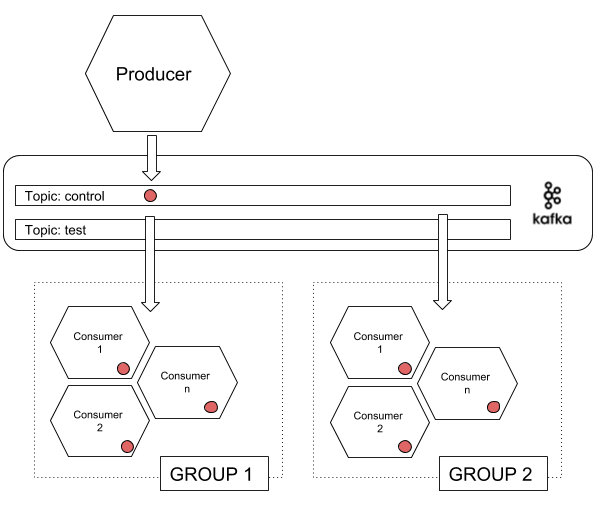
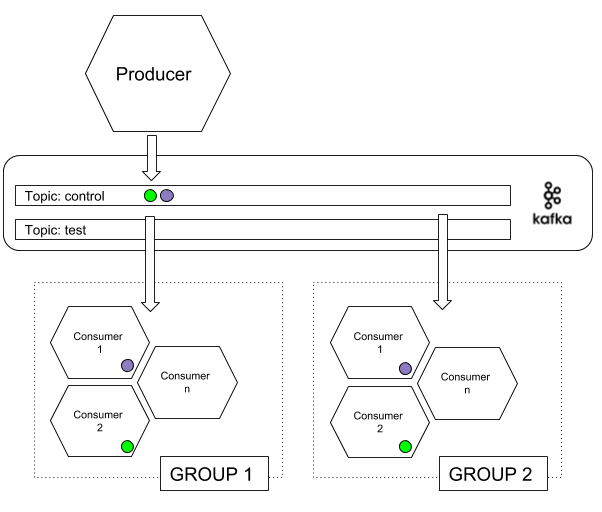

# Microservice Producer

This microservice can generate heavy load to a kafka server and to a MQTT server like Mosquitto. Use Spring Kafka in order to create a conection to the broker and produce messages. Also use Spring Integrations to stress MQTT broker. 

This service expose REST API in order to configure and start the execution.

**SERVICE UNDER CONSTRUCTION: documentation may not match with functionality 100%**

# Quickstart

Install and start the service.

```
git clone https://github.com/sbonacho/producer.git
cd producer
mvn spring-boot:run
```

Send PUT request to http://localhost:8080/producer

```
curl -X PUT -w "%{http_code}" -H "Content-Type: application/json" -d '{"messages": 1000, "threads": 2, "length": [50], "producerConfig": {"acks": 1, "bootstrap.servers": "localhost:9092"}, "topic" : "test", "waitForAck": true }' http://localhost:8080/producer
```

This command sends one control message using the kafka server configured con application.yml but generate load using configuration in the payload

# Executing a Test

The explanation of the execution:

**(1)** Producer sends one message to the topic control with all the information (messages, length, etc...) of the execution to all consumers.



Consumers has the overall test information in order to make some checks on the execution.

**(2)** Producer sends all messages to the topic tests to the producerConfig configuration.


 
## Payload Description

```
{
   "queueManager": "kafka",
   "messages":1000,
   "threads":2,
   "length":[ 50 ],
   "producerConfig":{  
      "acks":1,
      "bootstrap.servers":"localhost:9092"
   },
   "topic":"test",
   "waitForAck":true
}
```

- **queueManager:** ("kafka: default") could be "mqtt" for MQTT broker stress tests.
- **messages:** The number of total messages/events generated in this load test execution.
- **threads:** Number of thread used for the tests
- **length:** Length of the messages/events, [min, max]: for example: [1, 500] messages from 1 to 500 bytes. [100] messages of 100 bytes.
- **topic:** Topic used to send the messages
- **waitForAck:** default(false): if true each thread is going to wait for the ack response of kafka broker.
- **producerConfig**: All the configuration of the kafka broker to be stressed. Is possible to configure all producer parameters https://kafka.apache.org/documentation/#producerapi


# Running the service

```
mvn package
java -jar target/producer-0.1.0.jar
```

or

```
mvn spring-boot:run
```

## The run.sh Script

This script is used to wrap how to start/stop the microservice. Write the way you want to start/stop the microservice

# Docker Generation

```
mvn install dockerfile:build
```

## Running docker service

This command starts the service with domain-clients name

```
docker run --rm -dit -p 8080:8080 --name domain-clients sbonacho/producer
```

Watching logs

```
docker logs producer -f
```

Stopping the service

```
docker stop producer
```